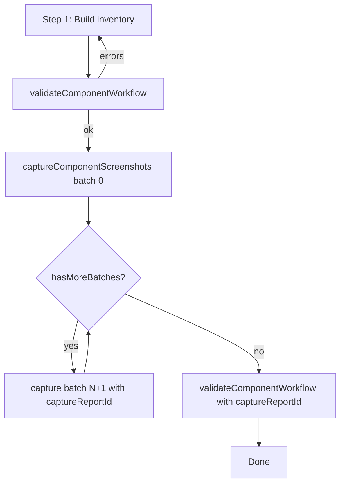

# Pixel Guard

Pixel Guard is an MCP app for UI visual validation. It compares source and destination pages with Playwright, writes report artifacts under your project workspace, and opens an interactive diff view in the MCP host.

## Quick start (remote — recommended)

Add this to your MCP config. **No clone, no manual server, no `--stdio` flag.**

```json
{
  "mcpServers": {
    "pixel-guard-remote": {
      "command": "npx",
      "args": ["-y", "https://github.com/ACSGenUI/pixel-guard#site-compare"],
      "env": {
        "PROJECT_ROOT": "/absolute/path/to/your-repo"
      }
    }
  }
}
```

The editor launches Pixel Guard via `npx` in stdio mode. Reports are written to:

```
PROJECT_ROOT/page-compare-<timestamp>/
  manifest.json
  source.png
  destination.png
  diff.png
```

You do **not** need to run `node output/main.js --http` or clone the repo for this setup.

---

## Requirements

- Node.js 20+ (Node 22 recommended)
- npm
- Chromium (installed automatically by Playwright on first comparison, or via `npm run playwright:install` for local dev)

## Local development installation

Only needed if you work on Pixel Guard itself or use **local** stdio/HTTP configs — **not** required for remote `npx` above.

```bash
cd <<pixel-guard-source-directory>>
npm install
npm run playwright:install
npm run build
```

`npm run build` compiles the server to `output/` (including `output/main.js`, the MCP entrypoint).

Optional — verify the HTTP server locally:

```bash
PROJECT_ROOT=<<PROJECT_ROOT>> npm start
# → Pixel Guard MCP server listening on http://localhost:3003/mcp
```

## Entrypoint

The npm bin is `output/main.js`:

```json
"bin": { "pixel-guard": "output/main.js" }
```

| Invocation | Mode |
|------------|------|
| `npx -y https://github.com/ACSGenUI/pixel-guard#site-compare` | **stdio** (remote MCP — default) |
| `node output/main.js` | **stdio** (local MCP — default) |
| `node output/main.js --http` | **HTTP** server on port 3003 (optional) |

Do **not** use `output/server.js` as the entrypoint — it exports the MCP server factory but does not start transport.

---

## MCP configuration

Replace placeholders:

| Placeholder | Meaning |
|-------------|---------|
| `<<pixel-guard-source-directory>>` | Absolute path to `mcp-apps/pixel-guard` (local dev only) |
| `<<PROJECT_ROOT>>` | Absolute path to the repo/workspace where reports are written |

### Environment variables

| Variable | Required | Purpose |
|----------|----------|---------|
| `PROJECT_ROOT` | Recommended | Report output root — files go to `<<PROJECT_ROOT>>/<report-id>/` |
| `PIXEL_GUARD_CAPTURE_BATCH_SIZE` | Optional | Components per `captureComponentScreenshots` call (default `4`) |
| `CHROME_DEVTOOLS_MCP_COMMAND` | Optional | Command to spawn chrome-devtools-mcp (default `npx`) |
| `CHROME_DEVTOOLS_MCP_ARGS` | Optional | Args for chrome-devtools-mcp (default `-y chrome-devtools-mcp@1.1.1 --headless`) |
| `PIXEL_GUARD_ORIGIN` | Optional | HTTP base URL for report links (e.g. `http://localhost:3003`) |
| `PORT` | Optional | HTTP server port (default `3003`) |

---

### Recommended: Remote stdio via `npx` — `pixel-guard-remote`

Same pattern as ui-audit. The editor starts Pixel Guard; reports go to `PROJECT_ROOT`, not the npx cache.

```json
{
  "mcpServers": {
    "pixel-guard-remote": {
      "command": "npx",
      "args": ["-y", "https://github.com/ACSGenUI/pixel-guard#site-compare"],
      "env": {
        "PROJECT_ROOT": "<<PROJECT_ROOT>>"
      }
    }
  }
}
```

- Use `-y` so `npx` does not prompt.
- **No `--stdio` arg needed** — `output/main.js` defaults to stdio.
- Do **not** pass `--http` — that starts an HTTP server instead of MCP stdio.
- Clear stale cache after GitHub updates: `rm -rf ~/.npm/_npx/*`

---

### Optional: Local stdio — `pixel-guard-local`

For contributors or offline use. Requires [local installation](#local-development-installation).

```json
{
  "mcpServers": {
    "pixel-guard-local": {
      "command": "node",
      "args": ["<<pixel-guard-source-directory>>/output/main.js"],
      "env": {
        "PROJECT_ROOT": "<<PROJECT_ROOT>>"
      }
    }
  }
}
```

---

### Optional: Local HTTP server — `pixel-guard-app`

For local development with hot reload. **You** start the server; the editor connects via URL.

```bash
cd <<pixel-guard-source-directory>>
PROJECT_ROOT=<<PROJECT_ROOT>> npm run dev
```

```json
{
  "mcpServers": {
    "pixel-guard-app": {
      "url": "http://localhost:3003/mcp"
    }
  }
}
```

Report URLs: `http://localhost:3003/reports/<report-id>/manifest.json`

---

### Optional: Remote HTTP server — `pixel-guard-remote-server`

**Only if you need a long-running HTTP MCP server** (shared host, multiple clients, CI). **Not required** for the recommended `pixel-guard-remote` npx config above.

1. Start the server on a machine that stays running:

   ```bash
   cd <<pixel-guard-source-directory>>
   npm install && npm run playwright:install && npm run build
   PROJECT_ROOT=<<PROJECT_ROOT>> PORT=3003 node output/main.js --http
   ```

2. Point MCP clients at it:

   ```json
   {
     "mcpServers": {
       "pixel-guard-remote-server": {
         "url": "http://your-server.example.com:3003/mcp"
       }
     }
   }
   ```

---

### Which mode should I use?

| Config | When to use | You run a server? |
|--------|-------------|-------------------|
| **`pixel-guard-remote`** | **Most users — remote MCP via npx** | No |
| `pixel-guard-local` | Local clone / offline dev | No (editor launches stdio) |
| `pixel-guard-app` | Local dev with hot reload | Yes (`npm run dev`) |
| `pixel-guard-remote-server` | Shared HTTP MCP on a host | Yes (`node output/main.js --http`) |

| Config | Transport | Reports | Report URLs |
|--------|-----------|---------|-------------|
| `pixel-guard-remote` | stdio | `<<PROJECT_ROOT>>/<report-id>/` | Filesystem path (images embedded in MCP UI) |
| `pixel-guard-local` | stdio | `<<PROJECT_ROOT>>/<report-id>/` | Filesystem path (images embedded in MCP UI) |
| `pixel-guard-app` | HTTP | `<<PROJECT_ROOT>>/<report-id>/` | `http://localhost:3003/reports/<report-id>/...` |
| `pixel-guard-remote-server` | HTTP | `<<PROJECT_ROOT>>/<report-id>/` | `http://<host>:3003/reports/<report-id>/...` |

---

## Scripts

| Script | Description |
|--------|-------------|
| `npm run build` | Type-check, build UI bundle, compile server to `output/` |
| `npm run dev` | Watch UI + HTTP server (`tsx main.ts --http`) |
| `npm run serve` | HTTP server only (`tsx main.ts --http`) |
| `npm start` | `build` then `serve` |
| `npm run playwright:install` | Install Chromium for Playwright |

## HTTP routes

Only relevant when running with `--http` (`npm run dev`, `npm start`, or remote HTTP server):

| Route | Content |
|-------|---------|
| `http://localhost:3003/mcp` | MCP endpoint |
| `http://localhost:3003/reports/<report-id>/` | Comparison artifacts (PNG + manifest) |
| `http://localhost:3003/playwright-report/` | Playwright HTML report (if present) |

## Usage — compare two pages

After Pixel Guard is connected in your MCP client, compare a source (baseline) page against a destination (corrected) page.

### Input template

Paste this in chat with your URLs filled in:

```
sourceUrl: https://www.example.com/page-before
destinationUrl: https://www.example.com/page-after
viewport: desktop
```

| Field | Required | Values |
|-------|----------|--------|
| `sourceUrl` | Yes | Baseline page URL (`http` or `https`) |
| `destinationUrl` | Yes | Corrected page URL (`http` or `https`) |
| `viewport` | No | `mobile`, `tablet`, `desktop` (default), `large` |

Example:

```
sourceUrl: https://www.linzess.com/savings-and-support
destinationUrl: https://main--abbvie-linzess-eds--nishant-adobe.aem.page/savings-and-support
viewport: desktop
```

### Slash command / prompt

Use the MCP prompt **`compare-page-visuals`** (shown as a slash command in Cursor when Pixel Guard is enabled).

You can invoke it with no args — the agent will ask for missing URLs — or pass the same fields as prompt arguments:

- `sourceUrl`
- `destinationUrl`
- `viewport` (optional)

### Two-step tool workflow

Pixel Guard runs comparisons in two steps:

| Step | Tool | What it does |
|------|------|--------------|
| 1 | `comparePageVisuals` | Captures screenshots, computes pixel diff, writes report to `PROJECT_ROOT/<report-id>/` |
| 2 | `openPageComparisonReport` | Opens the interactive report view (source, destination, diff images) |

The agent should call **Step 2** after Step 1 completes. If Step 1 returns `action: "request_parameters"`, provide the missing URLs and retry.

### What you get back

- **Pass/fail** based on pixel diff threshold (default 1%)
- **Summary** — e.g. `12.34% of pixels differ`
- **Report folder** under `PROJECT_ROOT`:

```
<<PROJECT_ROOT>>/
  page-compare-<timestamp>/
    manifest.json
    source.png
    destination.png
    diff.png
```

The MCP report view renders images from:

- **stdio mode** (`pixel-guard-remote`, `pixel-guard-local`) — base64 embedded in HTML from disk
- **HTTP mode** (`pixel-guard-app`, `pixel-guard-remote-server`) — served at `/reports/<report-id>/`

### Optional tool parameters

Advanced options for `comparePageVisuals` (defaults usually fine):

| Parameter | Default | Description |
|-----------|---------|-------------|
| `maxDiffPixelRatio` | `0.01` | Pass threshold (0–1). `0.01` = 1% |
| `fullPage` | `true` | Full-page screenshots |

---

## Usage — component inventory and screenshots

Pixel Guard builds a **component inventory** (selectors + metadata), validates it, then captures **one PNG per component** cropped to the CSS selector.

| Phase | Engine | Purpose |
|-------|--------|---------|
| **Discovery** (Step 1, auto mode) | chrome-devtools-mcp | Find blocks on the page |
| **Inventory validation** | Playwright | Resolve selectors, `visible`, `boundingBox` |
| **Screenshots** (Step 2) | **Playwright first** | `locator(selector).screenshot()` — element crop |
| **Screenshot fallback** | chrome-devtools-mcp | When Playwright cannot capture an element |

No separate `chrome-devtools` MCP server in your editor config — Pixel Guard spawns it internally for discovery/fallback only.

### Source layout

| File | Responsibility |
|------|----------------|
| `component-workflow.ts` | CSV template, inventory, batched capture, validation |
| `component-devtools.ts` | Chrome DevTools MCP client and browser discovery script |

### MCP tools

| Tool | Phase | Purpose |
|------|-------|---------|
| `getComponentInventoryCsvTemplate` | Setup | Copy bundled CSV template to `PROJECT_ROOT/templates/` |
| `importComponentInventoryFromCsv` | Step 1 | Import filled CSV → `inventory.json` |
| `inventoryPageComponents` | Step 1 | Auto-discover EDS blocks → `inventory.json` |
| `validateComponentWorkflow` | QA | Validate inventory and/or capture outputs |
| `captureComponentScreenshots` | Step 2 | Screenshot each component (batched) |

**MCP resource:** `pixel-guard://templates/component-inventory-template.csv`

### How screenshots work

Screenshots are **selector-based**, not bounding-box-based.

| Input | Used for capture? | Used for |
|-------|-------------------|----------|
| `selector` | **Yes** — finds the DOM node to photograph | Capture + inventory |
| `boundingBox` | **No** | Inventory QA only (`visible`, zero-size warnings) |
| `pageUrl` | Yes — navigation | Load the page before capture |

**Capture path (per component):**

1. Playwright opens the page and **dismisses cookie banners** (OneTrust, etc.).
2. `page.locator(selector).first().screenshot()` — PNG is **cropped to the element**.
3. If that fails → chrome-devtools-mcp fallback (`take_screenshot` by accessibility uid).

**Verify in `component-capture-*/manifest.json`:**

```json
{
  "id": "hero-homepage-0",
  "selector": "[data-block-name=\"hero-homepage\"]",
  "status": "captured",
  "captureEngine": "playwright"
}
```

| `captureEngine` | Meaning |
|-----------------|---------|
| `"playwright"` | True element screenshot via CSS selector (expected) |
| `"chrome-devtools-mcp"` | Fallback path — check selector or page load if output looks wrong |

**Selector tips:**

- Quote attribute values: `[data-block-name="hero-homepage"]` not `[data-block-name=hero-homepage]`
- Target the **content block**, not a wrapper that includes overlays
- If the hero PNG still shows a cookie banner with `"playwright"`, the selector matches too large a node — pick a tighter child selector

### Recommended workflow (end-to-end)



1. **Inventory** — CSV import (production) or `inventoryPageComponents` (EDS preview).
2. **Validate inventory** — `validateComponentWorkflow` with `inventoryId`. Fix selectors in CSV and re-import if needed.
3. **Capture in batches** — `captureComponentScreenshots` with `batchIndex: 0` (default 4 components per call). Repeat with the same `captureReportId` until `hasMoreBatches` is false.
4. **Validate captures** — `validateComponentWorkflow` with `inventoryId` and `captureReportId`.

### Batched capture (avoids MCP timeouts)

Large inventories (e.g. 13 components) are **not** captured in one tool call. Default **4 components per batch** keeps each call within MCP time limits.

**Example — 13 components (4 tool calls):**

| Call | Parameters |
|------|------------|
| 1 | `inventoryId`, `batchIndex: 0`, `batchSize: 4` |
| 2 | `inventoryId`, `captureReportId` *(from call 1)*, `batchIndex: 1`, `batchSize: 4` |
| 3 | `inventoryId`, `captureReportId`, `batchIndex: 2`, `batchSize: 4` |
| 4 | `inventoryId`, `captureReportId`, `batchIndex: 3`, `batchSize: 4` |

Each response includes:

| Field | Meaning |
|-------|---------|
| `hasMoreBatches` | `true` if another capture call is needed |
| `remainingComponentIds` | Component ids not yet captured |
| `nextStep` | Exact parameters for the next batch |
| `reportId` / `captureReportId` | Reuse for batches 1..N |

PNG files accumulate in one `component-capture-<timestamp>/` folder; `manifest.json` merges results after each batch.

To capture everything in one call (local scripts only), pass `batchSize: 13` (or the full component count).

### Why multiple folders appear

Every tool run creates a **new timestamped folder** under `PROJECT_ROOT`:

| Folder | Created by |
|--------|------------|
| `component-inventory-<timestamp>/` | `inventoryPageComponents`, `importComponentInventoryFromCsv`, or legacy one-step capture |
| `component-capture-<timestamp>/` | First `captureComponentScreenshots` batch (reuse this id for later batches) |

A typical run uses **one inventory folder** and **one capture folder** (even with multiple batch calls). Extra folders appear when the agent retries or uses legacy one-step mode (`pageUrl` only on capture creates both inventory and capture folders).

Use `inventoryId` and `reportId` from tool results. Delete old folders manually after validation passes.

### Validate before trusting outputs

**Tool:** `validateComponentWorkflow`

| When | Args | Checks |
|------|------|--------|
| After Step 1 | `inventoryId` | Selectors, visibility, bounding boxes, empty inventory |
| After Step 2 | `inventoryId` + `captureReportId` | PNG files on disk, skipped captures, coverage |

Writes `validation-report.json`. Returns `complete: true` when there are no **errors** (warnings may remain).

**Prompt:** `validate-component-workflow`

### Chrome DevTools MCP (discovery + fallback)

Pixel Guard spawns `chrome-devtools-mcp@1.1.1` headless as a subprocess. Override via `CHROME_DEVTOOLS_MCP_COMMAND` / `CHROME_DEVTOOLS_MCP_ARGS`.

| Used for | Not used for |
|----------|--------------|
| Auto-discovery (`inventoryPageComponents`) | Primary screenshot path |
| Screenshot fallback when Playwright fails | Cookie dismissal on capture (Playwright handles that) |

### Option A — CSV inventory (production and custom pages)

Best when auto-discovery fails (production sites without EDS `div.block` markup).

**Template columns:** `pageUrl | componentName | selector`

```
pageUrl|componentName|selector
https://main--abbvie-rinvoqhcp-eds--nishant-adobe.aem.page/|hero-homepage|[data-block-name="hero-homepage"]
https://main--abbvie-rinvoqhcp-eds--nishant-adobe.aem.page/|footer|[data-block-name="footer"]
```

**Example `inventory.json` entry** (metadata only — capture uses `selector`):

```json
{
  "id": "hero-homepage-0",
  "name": "hero-homepage",
  "selector": "[data-block-name=\"hero-homepage\"]",
  "visible": true,
  "boundingBox": { "x": 0, "y": 64, "width": 1024, "height": 344 }
}
```

If `visible` is `false` or `boundingBox.height` is `0`, fix the selector before capture.

| Step | Tool / resource |
|------|-----------------|
| 1 | `getComponentInventoryCsvTemplate` or resource `pixel-guard://templates/component-inventory-template.csv` |
| 2 | Agent fills one row per component |
| 3 | `importComponentInventoryFromCsv` |
| 4 | `validateComponentWorkflow` (`inventoryId`) |
| 5 | `captureComponentScreenshots` (batched) |
| 6 | `validateComponentWorkflow` (`inventoryId` + `captureReportId`) |

**Prompt:** `component-inventory-from-csv`

Pipe (`|`) delimiter is recommended when selectors contain commas.

### Option B — EDS auto-discovery (preview URLs)

Targets **AEM EDS (Franklin)** pages with `[data-block-name]` or `div.block`. Use an **EDS preview URL** (e.g. `main--*-eds--*.aem.page`).

**Step 1 — Inventory**

```
pageUrl: https://main--abbvie-rinvoq-eds--nishant-adobe.aem.page/atopic-dermatitis
components: hero-condition, columns, accordion
viewport: desktop
```

| Field | Required | Values |
|-------|----------|--------|
| `pageUrl` | Yes | Page URL |
| `components` | No | Block names; omit to auto-discover all blocks |
| `viewport` | No | `mobile`, `tablet`, `desktop` (default), `large` |

**Tool:** `inventoryPageComponents`

**Output:**

```
<<PROJECT_ROOT>>/component-inventory-<timestamp>/
  inventory.json
  overview.png
```

**Step 2 — Capture**

```
inventoryId: component-inventory-<timestamp>
batchIndex: 0
batchSize: 4
```

| Field | Required | Values |
|-------|----------|--------|
| `inventoryId` | Yes* | From Step 1 |
| `captureReportId` | No | From batch 0+; required for batches 1..N |
| `batchIndex` | No | Zero-based (default `0`) |
| `batchSize` | No | Per-call limit (default `4`) |
| `componentIds` | No | Subset to capture; omit for all |
| `pageUrl` | Yes* | Legacy one-step only |
| `viewport` | No | Viewport preset |

**Tool:** `captureComponentScreenshots`

**Output:**

```
<<PROJECT_ROOT>>/component-capture-<timestamp>/
  manifest.json          ← per-component status + captureEngine
  hero-homepage.png
  cards.png
```

Each PNG is cropped to its inventory `selector`. `manifest.json` merges across batches when using `captureReportId`.

**Prompt:** `inventory-page-components` → `capture-component-screenshots`

### Slash commands / prompts

| Prompt | Use for |
|--------|---------|
| `component-inventory-from-csv` | Production / manual selectors |
| `inventory-page-components` | EDS preview auto-discovery |
| `capture-component-screenshots` | Batched screenshot capture |
| `validate-component-workflow` | Inventory and capture QA |

### Legacy one-step mode

Pass `pageUrl` to `captureComponentScreenshots` to inventory and capture in one call (creates both folders; not recommended for large pages).

```
pageUrl: https://main--abbvie-rinvoq-eds--nishant-adobe.aem.page/atopic-dermatitis
viewport: desktop
```

---

## FAQ

### Do I need to clone the repo or run `node output/main.js --http`?

**No**, for the recommended remote setup (`pixel-guard-remote`). Just add the npx MCP config with `PROJECT_ROOT`.

Clone / build / `--http` are only for local development or the optional HTTP-server modes.

### Do I need `--stdio` in the npx config?

**No.** `output/main.js` defaults to stdio. Only pass `--http` when you intentionally want the HTTP server.

### `import: command not found` from `.bin/pixel-guard`

`npx` ran JavaScript with `sh` instead of Node. Ensure:

1. Package `"bin"` points to `output/main.js` (not `output/server.js`)
2. `output/main.js` starts with `#!/usr/bin/env node` (run `npm run build` on the published branch)
3. Clear npx cache: `rm -rf ~/.npm/_npx/*`

### MCP server does not show up

- **Remote stdio:** confirm `PROJECT_ROOT` is an absolute path; clear npx cache
- **Local stdio:** confirm `output/main.js` exists (`npm run build`)
- **HTTP:** confirm server is running and `http://localhost:3003/mcp` responds
- Reload MCP servers in the editor after config changes

### Reports not in my project folder

Set `PROJECT_ROOT` in MCP config `env`:

```json
"env": { "PROJECT_ROOT": "/absolute/path/to/your-audited-repo" }
```

Without it, reports fall back to `process.cwd()`.

### Playwright / Chromium errors

On first remote run, Playwright may need to download Chromium. For local dev:

```bash
npm run playwright:install
```

### What does `boundingBox` in inventory mean?

`boundingBox` is computed at **inventory import/discovery** time (Playwright `locator.boundingBox()`). It is stored in `inventory.json` for validation — **it is not used to crop screenshots**.

Use it to spot problems before capture:

| Signal | Likely issue |
|--------|--------------|
| `visible: false` | Selector not found or hidden (footer below fold, wrong selector) |
| `height: 0` or `width: 0` | Selector matches empty/collapsed wrapper |
| `confidence: low` | Auto-discovery guess — confirm selector in CSV |

### Hero screenshot includes cookie banner

Capture uses **Playwright element screenshots** first (`locator(selector).screenshot()`), which crops to the matched block only. The page is navigated with cookie dismissal before capture.

If you still see a banner:

1. Check `manifest.json` — `captureEngine` should be `"playwright"`. If it is `"chrome-devtools-mcp"`, Playwright failed and the fallback path ran (may include page chrome).
2. The selector may match a wrapper that visually includes the overlay — use a tighter child selector in CSV (see [How screenshots work](#how-screenshots-work)).
3. Re-capture after the site’s consent UI changes (OneTrust selectors are in both Playwright and DevTools dismiss scripts).

### Component capture times out

`captureComponentScreenshots` captures **4 components per call** by default. For 13 components, run **4 batches** with the same `captureReportId` and `batchIndex` 0 → 3. Check `hasMoreBatches` and `nextStep` in each tool response.

Reduce batch size if calls still time out:

```json
"env": {
  "PROJECT_ROOT": "/absolute/path/to/your-repo",
  "PIXEL_GUARD_CAPTURE_BATCH_SIZE": "3"
}
```

### Component not visible or screenshot skipped

Run `validateComponentWorkflow` on the inventory. Fix selectors in CSV (`templates/component-inventory-template.csv`), re-import with `importComponentInventoryFromCsv`, validate again, then re-capture failed `componentIds` only.

### Many `component-capture-*` folders

Only the **first** batch creates a new folder; later batches reuse `captureReportId`. Extra folders mean the agent retried without passing `captureReportId`, or used legacy one-step mode. Use the latest `reportId` from the batched run.

### Page comparison hangs or times out

Sites may be slow; comparisons wait for `networkidle` (up to 120s per page). Verify both URLs load in a browser.

### Very high diff percentage

Usually caused by different content, fonts, consent modals, or loading timing — not a tool bug. Inspect `diff.png` in the report folder.

### `EADDRINUSE` on port 3003

Only applies to HTTP mode:

```bash
PORT=3004 node output/main.js --http
```

Then use `http://localhost:3004/mcp` in MCP config.
